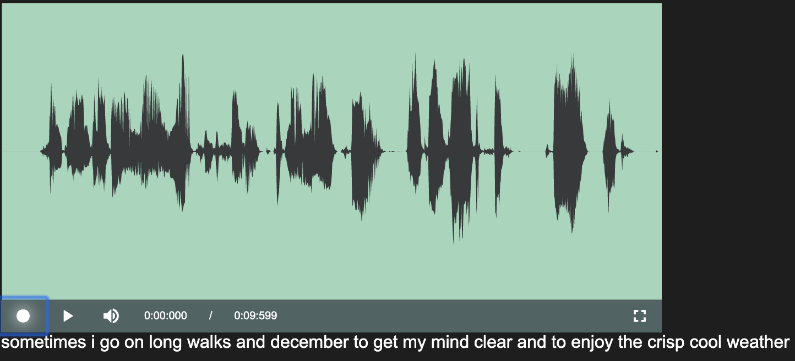

# deepspeech-playback





### Setup

* Download pre-trained English model and extract
```bash
curl -LO https://github.com/mozilla/DeepSpeech/releases/download/v0.5.1/deepspeech-0.5.1-models.tar.gz
tar xvf deepspeech-0.5.1-models.tar.gz
mv deepspeech-0.5.1-models server/
```

### Usage

```bash
docker-compose build

docker-compose up
```


### Dependencies

* https://github.com/mozilla/DeepSpeech/
* https://github.com/collab-project/videojs-record/